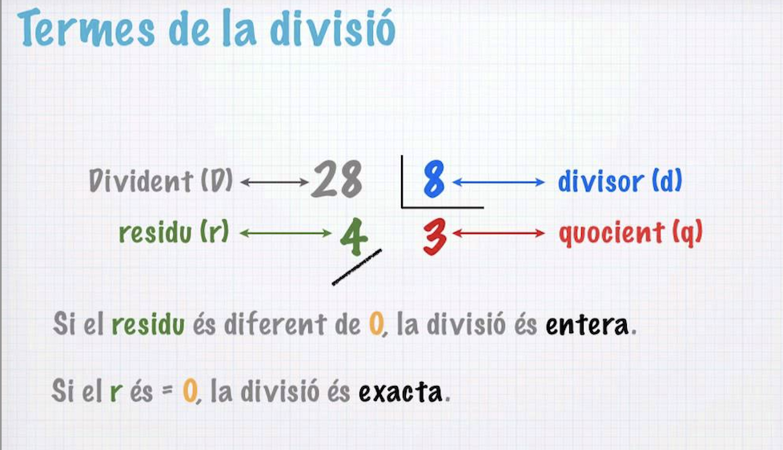

# PROVA 1 - 16 d'octubre de 2024

Fes els següents exercicis. Els pots fer en l'ordre que vulguis. En cas de no completar l'exercici 1 o el 5, penja els fitxers a la tasca corresponent del Classroom.

A part del correcte funcionament del programa, es valorarà l'eficiència del codi, el correcte ús de les variables, operadors i estructures i, també, el nom de les variables.

## Exercici 1

> 1 punt

Crea un nou repositori de GitHub anomenat `prova-1-prog-el_teu_nom` (sense cognoms). Configuració:

- Privat
- Crea automàticament el README
- La resta d'opcions deixa-les en la configuració per default

Comparteix-lo amb `Mar-PVV`.

Clona el repositori a la teva carpeta Programació del teu workspace.

## Exercici 2

> 1 punt

Si no has creat el repositori crea una carpeta anomenada `prova` dins la carpeta Programació del teu workspace.

Dins del respositori `prova-1-prog-el_teu_nom` o dins la carpeta `prova`, crea un fitxer Python anomenat `exercici_2`.

**Tria un dels dos codis** següents i arregla els errors detectats per tal de que el programa funcioni correctament.

### Codi 1

Funcionalitat del programa: donada una paraula i un número de l’1 al 10, et diu si la paraula té més / menys lletres que el nombre donat. 

```python
Paraula = 'Hola'
nombre = '3'

if len(paraula) > nombre:
    print 'La paraula ' + paraula + ' té més de ' + str(nombre) + 'lletres.'
elif len(paraula) = nombre:
    print 'La paraula ' + paraula + ' té ' + str(nombre) + ' lletres.'
else:
    print 'La paraula ' + paraula + ' té menys de ' + str(nombre) + 'lletres.'
```

### Codi 2

Funcionalitat del programa: donat un nombre aleatori de l’1 al 12 et retorna quants dies té el mes corresponent a aquest nombre.

```python
import random

mes = random.randint(1,12)

if mes == 2:
    print(El febrer té 28 dies.)
elif mes == 4 and mes == 6 and mes == 9 and mes == 11:
    print(El mes seleccionat( + str(mes) + ) té 30 dies.)
else mes == 1 and mes == 3 and mes == 5 and mes == 7 and mes == 8 and mes == 10 and mes == 12:
    print(El mes seleccionat( + str(mes) + ) té str(31) dies.)
```

## Exercici 3

> 1 punt

Dins del respositori `prova-1-prog-el_teu_nom` o dins la carpeta `prova`, crea un fitxer Python anomenat `exercici_3`.

Fes un programa que donat un número, `dividend`, a l'atzar de l'1 al 90 i un altre, `divisor` , de l'1 al 15 et retorni:

`La divisió de <dividend> entre <divisor> té com a quocient <quocient> i residu <residu>`



A més, fes que et retorni si la divisió és exacta o no:

`La divisió de <dividend> entre <divisor> és / no és exacta`

## Exercici 4

> 2 punts

Un usuari ha d'introduir la data de naixement i quants anys té. El programa que has de fer, retorna:

- `Edat i data de naixement correcta: si vas nèixer a <data> tens <edat> anys.`
- `Edat o data de naixement incorrecta: si vas nèixer a <data> no tens <edat> anys, en tindries <edat_correcta_respecte_la_data>`

Fixa't que has de tenir en compte la data d'avui.

Crea les variables `dia`, `mes`, `any` i `edat`. Assigna un valor correcte per la data. Ves modificant l'edat depenent el que t'interessi provar del programa. Aquesta data correspondrà a la data de naixement i a l'edat de l'usuari.

Pots crear altres variables necessaries per completar el programa.

## Exercici 5

> 1 punt

Puja els canvis del respositori `prova-1-prog-el_teu_nom` al GitHub.
