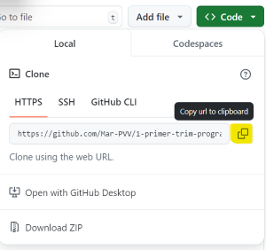

# PRÀCTICA 3 - Set up Git i GitHub

En aquesta pràctica instal·larem i farem la primera presa de contacte amb el GitHub i el Git.

## Teoria

Consulta el [pdf](./Pràctica_3-Teoria.pdf) de teoria.

## Pràctica

### El meu primer repositori

Primer de tot crearem el nostre primer repositori de GitHub des de la web.

Good-practices pel nom del repositori:

- Use lower case.
- Use dashes.
- Be specific.
- Be consistent. How do you want your repositories to be sorted/grouped?

Exemples:

```code
star-wars.git
the-empire-strikes-back.git
return-of-the-jedi.git
```

Per fer-ho tots igual crea'l amb el nom `my-first-repo`. Respecte la configuració, sempre farem servir repositoris privats i ja els compartireu amb la professora per la seva correcció.

### Elements bàsics del repositori

Tots els repositoris han de tenir el seu README.md (.md és l'extansió de Markdown). En aquest document s'hi troba la descripció general del projecte i altres elements depenent del tipus de projecte: com s'utilitza el projecte, com s'hi pot contribuir, com es pot instal·lar...

Pels documents tipus "text" dels projectes, com el README.md, s'utilitza el Markdown. El Markdown és un [llenguatge de marques lleuger](https://es.wikipedia.org/wiki/Lenguaje_de_marcado_ligero), originalment creat per John Gruber i Aaron Swartz que permet "escriure utilitzant un format de text pla fàcil d'escriure i de llegir i després convertir-ho en un XHTML o HTML estructuralment vàlid". (Font: Viquipèdia)

Aquí teniu una [guia](https://www.markdownguide.org/basic-syntax/) d'aquest llenguatge.

Creeu el vostre README.md des del GitHub. Ha de contenir un títol i una breu descripció explicant que és el vostre primer respositori i que forma part de la matèria de programació.

Guardeu el README.md, què us apareix? Què us proposa el GitHub?

### Baixem el repositori al nostre workspace

En aquest apartat ens baixarem el repositori remot, el que acabem de crear al GitHub, com a repositori local per poder treballar des del nostre workspace.

Obrim el terminal i anem dins la carpeta de programació.

En aquesta fem:

```bash
git clone <url del repositori remot>
```

Com trobar la url:



Mirem que ens apareix:

```bash
dir
cd my-first-repo
dir
```

Observem l'status del git:

```bash
git status
```

### Creem un fitxer i el pugem al reomte repository

Crea un fitxer Python dins del respositori local `my-first-repo` amb un programa que donat el nom i els anys d'una persona (variables inicials), t'imprimeix per pantalla: `El/La <nom> té <anys> anys i, per tant, porta viu <segons> segons.`

Un cop provat el programa, posa en pràctica les comandes corresponents per pujar el nou fitxer del repositori al repositori remot de GitHub. El missatge del commit ha de descriure els canvis que hem fet. Per exemple: Afegir programa Python years to seconds.

### Modifiquem el README i pugem els canvis

Modifica el README per afegir la descripció del programa que has creat. Fes un apartat `Command Cheat Sheet` al README amb les comandes de git necessàries per actualitzar els canvis del repositori remot. Utilitza els estils pertinents del Markdown.
